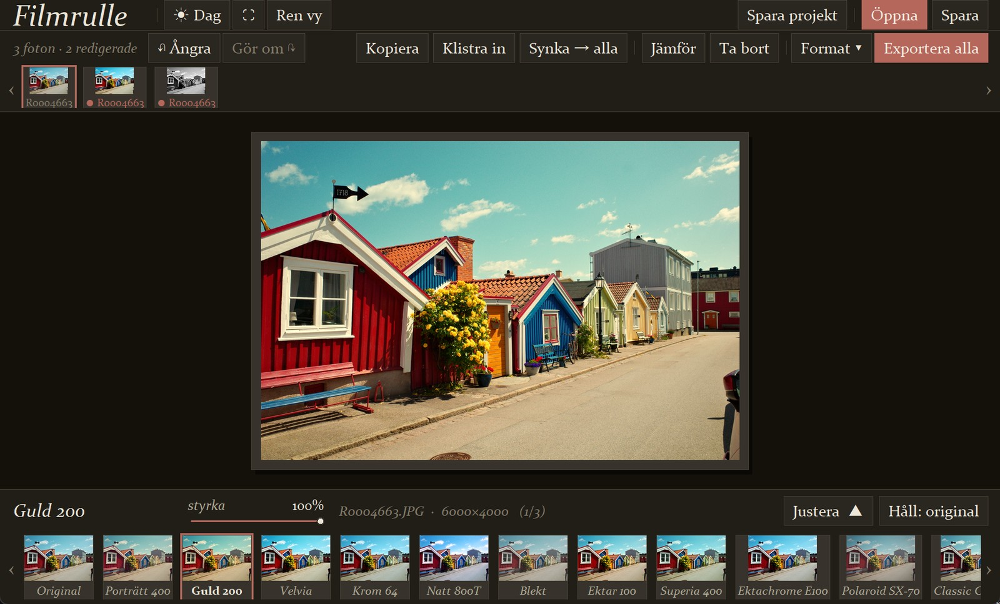
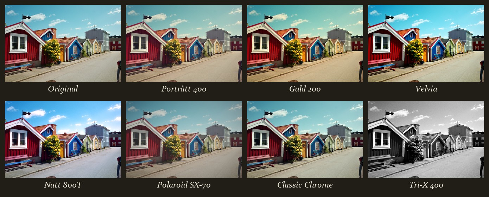
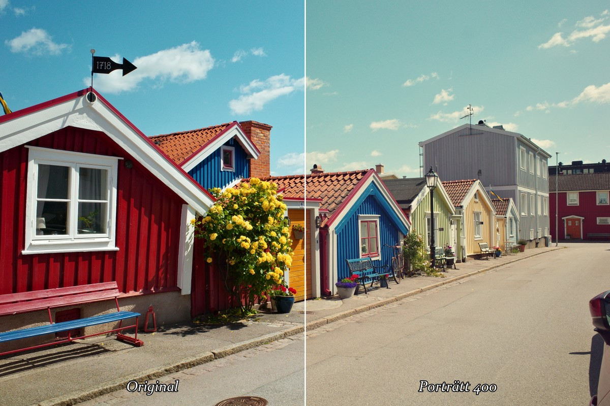
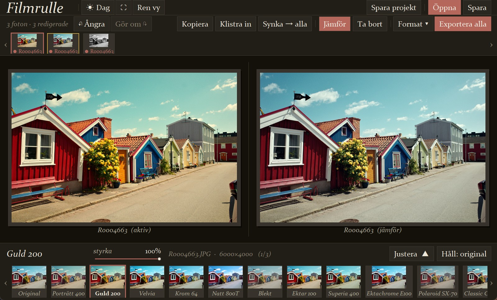
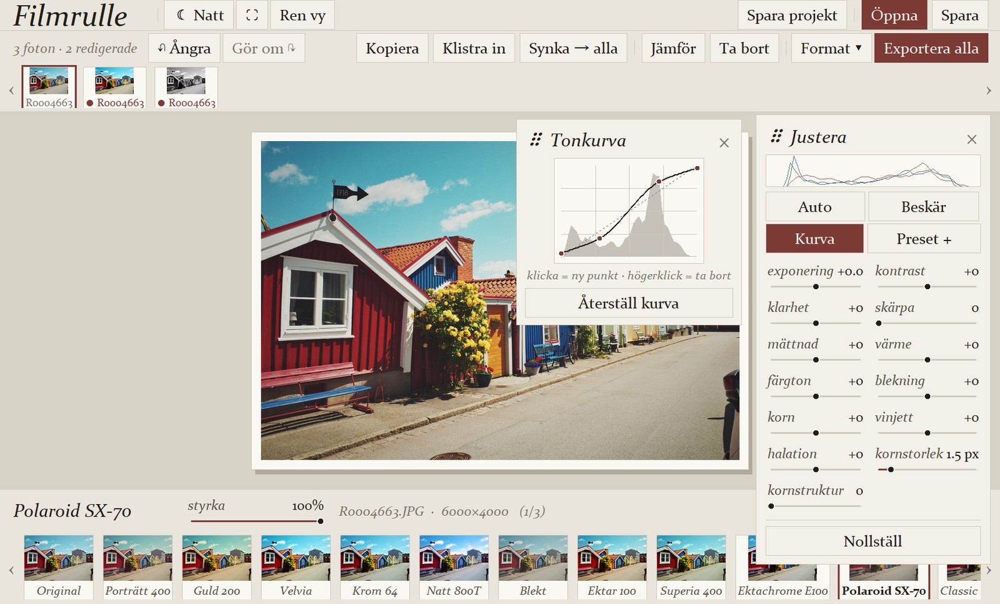

# Filmrulle (v2.1)

En liten, fristående fotoredigerare för **analoga / retro filmsimuleringar**.
Öppna ett foto, välj en filmstock, finjustera med några reglage, exportera.

Ingen molntjänst, inga konton — all bildbehandling görs lokalt i numpy + Pillow.



**26 filmrecept** — från Porträtt 400 och Velvia till Polaroid SX-70 och Tri-X:



<table>
  <tr>
    <td width="50%"></td>
    <td width="50%"></td>
  </tr>
  <tr>
    <td align="center"><em>Före / efter — original mot Porträtt 400</em></td>
    <td align="center"><em>Jämför två recept sida vid sida</em></td>
  </tr>
</table>


<p align="center"><em>Ljust tema · egen tonkurva · reglage för exponering, korn, halation, vinjett m.m.</em></p>

## Kör

**Färdig exe:** `dist\Filmrulle.exe` (dubbelklicka — inga beroenden behövs).

**Från källkod:**
```
pip install -r requirements.txt
python filmrulle.py
```

**macOS:** bygg via GitHub Actions-arbetsflödet `.github/workflows/build-macos.yml`
(körs på riktiga Mac-runners i molnet, både Apple Silicon och Intel — ingen
egen Mac behövs för att bygga). Ladda ner `Filmrulle-macOS-*.zip` från körningens
Artifacts, packa upp och dubbelklicka `Filmrulle.app`.

> Appen är **osignerad** (inget betalt Apple-utvecklarkonto), så macOS
> Gatekeeper blockerar öppningen med "Apple kunde inte verifiera...". På
> nyare macOS (Sequoia+) räcker inte längre högerklick → Öppna — dialogen
> visar bara "Flytta till papperskorgen" / "Klar", inget sätt att öppna
> ändå. **Säkraste lösningen** (funkar oavsett macOS-version): öppna
> Terminal, skriv `xattr -cr ` (med mellanslag efter), dra in
> `Filmrulle.app` från Finder så sökvägen fylls i, tryck Enter, dubbelklicka
> sedan appen igen. Alternativt: Systeminställningar → Sekretess och
> säkerhet → scrolla ner → "Öppna ändå" (dyker bara upp EFTER ett första
> blockerat öppningsförsök).

## Format & import

JPG, PNG, BMP, TIFF, WebP — plus **HEIC/HEIF** (mobilfoton) och **RAW**
(CR2/CR3/NEF/ARW/DNG/RAF/ORF/RW2) när de valfria paketen `pillow-heif`
respektive `rawpy` finns (den byggda exen har dem inbakade). **Öppna** öppnar
Windows egen filväljare — markera ett eller flera foton. Man kan även **dra
och släppa** bildfiler direkt på fönstret.

Inläsningen sker i **bakgrunden** — foton dyker upp i rullen ett i taget med
en räknare i headern, och appen förblir användbar under tiden. Importen läser
bara en förhandsvisning (RAW i halv upplösning, JPEG nedskalad redan vid
avkodningen), vilket är ~3× snabbare än en full avkodning och tar ~5 MB RAM
per foto i rullen.

Formatet avgörs av filens **innehåll**, inte bara ändelsen: en JPEG som fått
ändelsen `.DNG` (som kameraappar ibland sparar om bilder vid överföring till
mobilen) öppnas ändå. En äkta RAW som LibRaw inte kan avkoda ger ett tydligt
fel — aldrig tyst den 160 px-miniatyr som finns inbäddad i filen. Misslyckas
en fil visas orsaken i statusraden.

RAW-filer avkodas i **16 bitar** (kamerans sensordjup, 12–14 bitar per kanal)
istället för att rundas av till 8 bitar direkt — det tondjupet finns kvar att
jobba med vid kraftiga skugglyft eller highlight-recovery. Övriga format läses
i 8 bitar (deras naturliga djup). Full upplösning + fullt bitdjup läses alltid
om från originalfilen vid Spara/Exportera; förhandsvisningen är nedskalad för
skärmen men påverkar aldrig exportens kvalitet.

## Filmer

| Film | Look |
|------|------|
| Original | orörd |
| Porträtt 400 | varm, mjuk kontrast, hudvänlig |
| Guld 200 | gyllene, nostalgisk |
| Velvia | mättad, hög kontrast, knivskarp |
| Krom 64 | ren, sval, klar |
| Natt 800T | tungsten-kall, röd halation kring högdagrar |
| Blekt | matt, dammig, låg mättnad |
| Ektar 100 | mättad men naturtrogen, fint korn |
| Superia 400 | svala gröna skuggor, dämpade pastellfärger |
| Ektachrome E100 | ren, klar, kall dia-look |
| Polaroid SX-70 | mjuk, låg kontrast, urblekt, drömsk + vinjett |
| Classic Chrome | dov, avmättad reportagelook, svala skuggor |
| Classic Neg | teal skuggor + bärnstensfärgade högdagrar, punchiga röda |
| Eterna | cinematisk, låg mättnad, flat, lätt grön |
| Nostalgic Neg | varm bärnsten, lyfta skuggor, 70-talskänsla |
| Astia | mjuk kontrast, mild mättnad, smickrande hud |
| Porträtt 160 | ännu lägre kontrast + finare korn än 400, subtila mjuka färger |
| Pro 400H | luftig, svala dämpade gröna/blå, rena högdagrar |
| Provia 100F | neutral dia — sansad mättnad, naturtrogna färger (Velvias motpol) |
| Cinestill 50D | slät, finkornig dagsljusfilm, mycket balanserad palett |
| Cinestill 800T | tungsten-sval med utpräglad röd/orange halation kring ljus |
| ColorPlus 200 | budget-look, mjuk kontrast, varm men urblekt |
| Agfa Vista | punchig konsumentfilm, magenta i skuggorna |
| HP5 · Svartvitt | korn + kontrast |
| Tri-X 400 | grittig, kontrastrik dokumentär-svartvitt |
| Acros | ren svartvitt, djup kontrast, krispig skärpa, finkornig |

## Design & vy

Bild-först "galleri"-skal: fotot hängs som en **monterad kopia** (passepartout +
slagskugga) på matt kartong, serif-typografi som bildtexter, oxblod som enda
accent, egenritade slider-spår. Medvetet byggt för att *inte* likna en typisk
mörk tkinter-app. Windows egen titelrad (minimera/maximera/stäng) behålls
helt native — men färgas via DWM för att matcha aktuellt tema (ljus/mörk)
istället för att alltid stå kvar vit.

Uppe till vänster finns vy-knapparna:

- **☾ Natt / ☀ Dag** — växla mellan det ljusa galleri-temat och ett **mörkt
  nattema** (skonsammare vid redigering i mörker). Hela skalet byter färg;
  rullen, recepten och ångra-historiken behålls. Valet **minns till nästa
  gång** du öppnar appen.
- **⛶** — **helskärm**, äkta OS-helskärm (även `F11`).
- **Ren vy** — dölj all chrome (header, rulle, filmremsa) och visa bara fotot.
  Bra för att bedöma en bild ostört. Detta är INTE samma sak
  som helskärm (⛶/F11) — Ren vy döljer bara appens egna paneler, kopplar
  aldrig på äkta OS-helskärm, och stänger av den om den råkar vara på.

## Justera

Reglagen (Exponering, Kontrast, **Klarhet**, **Skärpa**, Mättnad, Värme,
**Färgton**, Blekning, Korn, Vinjett, Halation) läggs på som **offset ovanpå**
den valda filmens baslinje och nollställs — liksom tonkurvan — när du byter
film. **Kornstorlek**
styr hur grova kornen är och **Kornstruktur** deras karaktär — från mjukt,
molnigt korn (0) till hårt, gryning korn (100), utan att ändra mängden.
Panelen kan **dras runt** — greppa rubriken (⠿), och stängs med det lilla
**×**-krysset uppe till höger (samma på Kurva- och Format-panelerna).
**Håll: original** (eller mellanslag) visar obehandlad bild för jämförelse.

Överst i panelen finns ett live-**histogram** (RGB) och snabbverktygen:

- **Auto** — auto-nivåer (exponering + kontrast från percentiler) +
  vitbalans i ett klick. Vitbalansen väger bort starkt mättade partier
  (himmel, direkt solljus) och dämpar korrigeringen, så en äkta varm scen
  (solljus, gyllene timme) inte "korrigeras" bort mot blått.
- **Beskär** — se nedan.
- **Kurva** — öppnar en dragbar **tonkurva** (klicka = ny punkt, högerklick =
  ta bort, ändpunkterna låsta i x). Kurvan är **mjuk och monoton** (PCHIP,
  som i Lightroom — inga knyckar mellan punkterna, ingen översvängning), och
  linjen på skärmen är exakt den mappning som appliceras på bilden. Bakom
  kurvan visas det aktiva fotots **luminanshistogram**, så du ser var i
  tonomfånget bildens information ligger. Handtagen är runda, förstoras vid
  hover/drag, och en **in → ut**-avläsning visas medan du drar en punkt.
  Kurvan läggs ovanpå filmens inbakade kurvor, är per-foto och följer med i
  export/projekt.
- **Preset +** — spara nuvarande look som eget kort, se nedan.

Preview renderas på en nedskalad arbetskopia i en bakgrundstråd (mjuk vid
draggning); export renderas alltid i full upplösning.

## Egna presets

**Preset +** sparar nuvarande look (film + reglage + tonkurva + kornstorlek/
-struktur) som ett **eget kort** sist i filmremsan. Presets sparas i
`~/.filmrulle_presets.json` (atomiskt — ett avbrott mitt i sparningen kan inte
förstöra filen) och finns kvar mellan sessioner. **Högerklicka** på ett eget
kort för att ta bort det (du får bekräfta först) — foton som använde preseten,
även i ångra-historiken, faller tillbaka på Original.

## Beskär & räta upp

**Beskär**-knappen öppnar ett beskärningsläge: dra i **hörnen** för att ändra
bredd och höjd samtidigt, dra i **kant-handtagen** (mitten på varje sida) för
att bara ändra bredd eller höjd, dra inuti för att flytta. Alla handtag har
en dubbel mörk/ljus kontur så de syns tydligt oavsett hur ljus eller mörk
bilden är under. Välj **förhållande** (Fri, Original, 1:1, 3:2, 4:3, 16:9,
2:3, 4:5), och **räta upp** med vinkelreglaget. Tredjedelsrutnät hjälper
kompositionen. **Klar** tillämpar, **Avbryt** (eller Esc) ångrar. Beskärningen
är en del av fotots recept — den följer med i styrka, synk, export och projekt.

## Betygsätt (pick / reject)

Tryck **`p`** för att välja ut (✓ grön), **`x`** för att rata (✗ röd), **`u`**
för att rensa. Ratade foton **hoppas över** vid *Exportera alla*. Markörerna
syns på rullens tumnaglar.

## Zoom

**Scrolla** över fotot för att zooma in mot muspekaren — då släpps ramen och du
kan **dra runt** bilden (loupe-läge, zoom-% visas nere till vänster). Du kan
också panorera genom att **hålla ner mittenknappen** (skrollhjulet) och dra.
**Dubbelklick** återställer till den monterade vyn.

## Jämför (två foton sida vid sida)

**Jämför**-knappen delar fotoväggen i två — det **aktiva** (redigerbara)
fotot till vänster, ett **jämförelsefoto** till höger, båda med sitt eget
recept. Det aktiva/vänstra fotot är **låst** så länge jämförelseläget är på
— du kan inte byta det av misstag genom att klicka runt. Så här styr du läget:

- **Klicka på ett foto i rullen** — väljer det som HÖGER (jämförelse-)bild.
  Vanligt klick räcker, inget behov av att hålla Skift. Jämförelsefotot får
  en **senapsgul kant** i rullen så det syns vilket det är (skilt från
  oxblod = aktiv, grönt/rött = betyg).
- **Justera**-panelen, filmremsan och alla reglage fungerar som vanligt —
  ändringarna gäller alltid det **aktiva** (vänstra) fotot.
- Tryck **Jämför** igen för att lämna läget — då låses upp vilket foto som är
  aktivt igen (vanligt klick i rullen och `Ctrl+←`/`Ctrl+→` byter tillbaka
  till att välja aktivt foto).

## Export & format

**Format ▾** öppnar en liten flytande panel:

- **JPEG** — komprimerad, med justerbar **kvalitet** (60–100). Standard 95.
- **PNG** — förlustfritt, större filer.
- **TIFF** — förlustfritt (LZW-komprimerat), för vidare redigering i annan mjukvara.

Valet gäller både **Spara** (enskilt foto) och **Exportera alla**. Vid enskild
Spara styr även filändelsen du väljer i dialogen formatet. Båda renderar i
**bakgrunden** — appen fryser inte medan fullupplösningen räknas fram.

Exporten **behåller källans metadata**: kamera, objektiv­data, tagningsdatum,
GPS (EXIF) och **färgprofil** (ICC — viktigt för iPhone-bilder i Display P3,
som annars ser urblekta ut). Orienteringen sätts till "upprätt" eftersom
pixlarna redan är roterade. TIFF får kamera/datum men inte hela EXIF-blocket
(libtiff-begränsning). Filer skrivs först till en temporär fil och byts in
när de är kompletta, så en avbruten export lämnar aldrig en trasig bild.
Egna presets ger sitt namn som filsuffix (`foto_Min_Look.jpg`).

## Tangentbord

| Tangent | Gör |
|---|---|
| `Ctrl+O` / `Ctrl+S` | Öppna (flerval) / Spara aktivt foto |
| `Ctrl+B` | Exportera alla |
| `Ctrl+Z` / `Ctrl+Y` | Ångra / gör om |
| `Ctrl+Shift+S` | Spara projekt |
| `p` / `x` / `u` | Utvald / ratad / rensa betyg |
| `Ctrl+C` / `Ctrl+V` | Kopiera / klistra in inställningar |
| `Ctrl+Skift+V` | Synka kopierade inställningar till alla foton |
| `Ctrl+←` / `Ctrl+→` | Föregående / nästa foto i rullen |
| `Delete` | Ta bort aktivt foto ur rullen |
| `Mellanslag` (håll) | Visa original |
| `←` / `→` | Byt film (loopar runt) |
| `0` | Återställ zoom |
| `F11` | Helskärm |
| `Esc` | Backa ur innersta läget: beskärning → öppna paneler → jämförelse → helskärm → ren vy |

På **macOS** fungerar även `Cmd` istället för `Ctrl`, och högerklick (ta bort
preset/kurvpunkt) och mittenklick (panorera) är mappade rätt för Mac.

Klick på den redan valda filmen nollställer justeringarna. **Mushjulet över
ett reglage** finjusterar ett steg i taget (dragning för stora hopp, hjulet
för precision) — en tät hjulserie räknas som ett enda ångra-steg.

## Foto-rulle (Lightroom-liknande arbetsflöde)

**Öppna** tar flera foton på en gång och lägger dem i en rulle högst upp.
Varje foto bär sitt **eget** recept (film + justeringar + styrka) — klicka dig
runt i rullen (eller `Ctrl+←`/`Ctrl+→`) och gör olika ändringar på varje bild;
**dra ett kort** i rullen för att ändra ordningen på foton (t.ex. inför
export) — släpp helt enkelt kortet där du vill ha det, ordningen sparas i
projektfilen och styr i vilken ordning Exportera alla går igenom rullen;
de sparas automatiskt när du växlar till ett annat foto. Rullens tumnaglar
uppdateras med den grade:ade looken när du lämnar ett foto; redigerade foton
markeras med en oxblod-punkt (●) och räknas i verktygsraden
("14 foton · 3 redigerade"). Remsorna har scrollpilar ‹ › i kanterna
(mushjulet funkar också), och filmremsan har en avdelare mellan färg och
svartvitt.

- **Kopiera** / **Klistra in** — för över ett fotos recept till ett annat.
- **Synka → alla** — applicera det **aktiva** fotots look på *alla* foton i
  rullen (kräver ingen föregående Kopiera — "gör alla som den jag tittar på").
- **Jämför** — visa **två foton sida vid sida** (aktivt till vänster). Väljer
  automatiskt nästa foto till höger; **Skift-klicka** ett annat kort i rullen
  för att byta höger bild. Klicka vidare i rullen byter vänster (aktiv). Tryck
  Jämför igen för att lämna läget. Se nedan.
- **↶ Ångra** (`Ctrl+Z`) — ångra senaste ändringen: reglage, filmbyte,
  nollställ, klistra in, synka, ta bort foto, till och med en import. Varje
  dragrörelse på ett reglage är ett eget ångra-steg (upp till 50 bakåt).
- **Ta bort** — plockar bort aktivt foto ur rullen (rör inte filen på disk).
- **Format ▾** — öppnar en liten panel för **exportformat** (JPEG / PNG / TIFF)
  och **JPEG-kvalitet**. Gäller både Spara och Exportera alla. Se nedan.
- **Exportera alla** — renderar varje foto i full upplösning med **sitt eget**
  recept till en vald mapp, i valt format, med filmnamnet som suffix
  (`foto_velvia.jpg`); befintliga filer skrivs inte över.

Bara nedskalade arbetskopior hålls i minnet per foto — full upplösning läses
om från disk vid Spara/Exportera, så en rulle med många högupplösta foton
inte äter flera GB RAM.

## Projekt (spara & fortsätt senare)

**Spara projekt** (`Ctrl+Shift+S`) sparar hela rullen — filvägar, alla recept
(film + justeringar + beskärning) och betyg — till en liten `.filmrulle`-fil.
Bildpixlar sparas inte i projektfilen; originalen läses om från sina platser
på disk. Varje foto sparas med både absolut sökväg och sökväg **relativt
projektfilen** — flyttar du hela mappen (foton + projekt) till en extern disk
eller en annan dator hittas fotona ändå.

**Öppna projekt:** välj `.filmrulle`-filen via vanliga **Öppna**-knappen
(filväljaren har en egen "Filmrulle-projekt"-grupp) — eller **dra och släpp**
projektfilen på fönstret. Har du redan foton i rullen frågar appen innan den
ersätts. En trasig eller handredigerad projektfil läses så långt det går
(dåliga fält får standardvärden) och rör aldrig din nuvarande rulle om den
inte går att öppna.

## Felsökning

Oväntade fel skrivs med fullständig traceback till
`~/.filmrulle_errors.log` (den byggda exe:n har ingen konsol, så det är enda
stället de syns) och en kort rad visas i statusfältet. Bifoga loggen om du
rapporterar ett problem.

## Tester

```
pip install -r requirements-dev.txt
python -m pytest tests
```

Sviten (~90 tester, ~20 s) täcker varje bugg som hittats vid revisionerna
samt bevisar att den prestandaoptimerade pipelinen ger samma bild (inom en
8-bitarsnivå) som den frysta v2.0-referensen i `tests/reference_pipeline_v20.py`
för alla filmer och slumpade justeringar. Testerna rör aldrig dina riktiga
inställnings-/presetfiler.

## Bygga om exe

```
powershell -ExecutionPolicy Bypass -File rebuild_exe.ps1
```

## Hur det fungerar

Kärnan är `process(arr, grade)` i `filmrulle.py` — en stegvis pipeline på en
float32-bild (0–1): exponering → vitbalans → kontrast → per-kanal kurvor →
mättnad → delton → ev. svartvitt → matt-lyft → halation → korn → vinjett.
Varje `Grade` (filmen) är bara parametrar till samma pipeline.

Pipelinen arbetar in-place och applicerar varje (h,w)-mask kanal för kanal
istället för att broadcasta den mot bilden (numpy är 4–6× långsammare på
`mask[..., None]`-mönstret), och kurvor slås upp i 65536-steg-LUT:ar istället
för `np.interp` per pixel — ~2× snabbare rendering än v2.0 med samma resultat.
